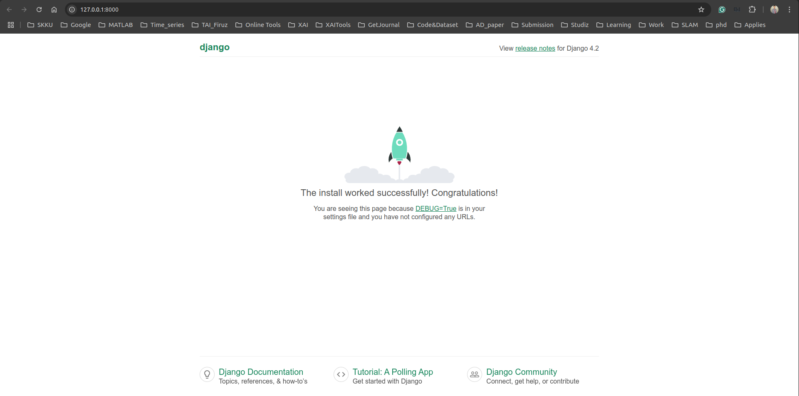

# Virtual environment
Creating a virtual environment named `.venv`
```
python3 -m venv .venv
```
Activate the environement 
```
source .venv/bin/activate
```
Updating pip and installing django in virtual environment 
```
python -m pip install --upgrade pip
python -m pip install django
```

# Django commands
Creating a new django project to the current working directory (`.` at the end):
```
django-admin startproject <projectName> .
```
The `<projectName>` is `defaultDjango`.

It creates the following within `defaultDjango`:
1. `manage.py`: Django command-line administrative utility of the project. General syntex for running administrative commands `python manage.py <command> [optoins]`.
For example, runining the project `python manage.py runserver`. 
2. A subfolder named `defaultDjango`, which contains the following files:
    > `__init__.py`: an empty file that tells Python, this folder is a Python package. \
    > `asgi.py` and `wsgi.py`: hooks for production web servers and **DO NOT MODIFY**. \
    > `settings.py` and `urls.py`: settings and table of contents which **CAN BE MODIFIED**.

Direct to the project directory:
```
cd defaultDjango/
```
Create an empty development database:
```
python manage.py migrate
```
When runing the server first time, it creates a default `SQLite` database in the file `db.sqlite3`.

Running the server to a specify port instead of deatult 8000:
```
python manage.py runserver <port>
```
The server will start with the following print on the terminal:
```TypeScript
Watching for file changes with StatReloader
Performing system checks...

System check identified no issues (0 silenced).
March 28, 2025 - 03:55:13
Django version 4.2.20, using settings 'defaultDjango.settings'
Starting development server at http://127.0.0.1:8000/
Quit the server with CONTROL-C.
```
On click at `http:127.0.0.1:<port>/` URL in the terminal, opens the default page in browser. 
<div style="text-align: center;">
    
</div>
